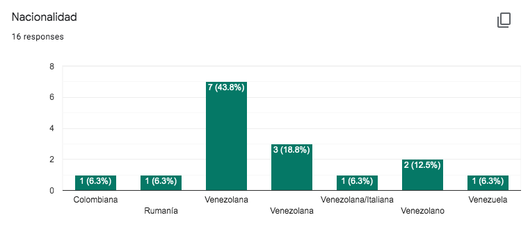
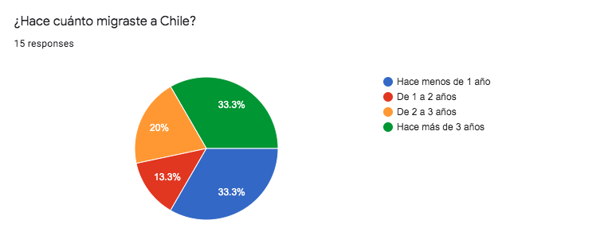
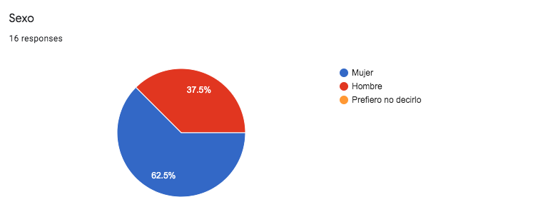
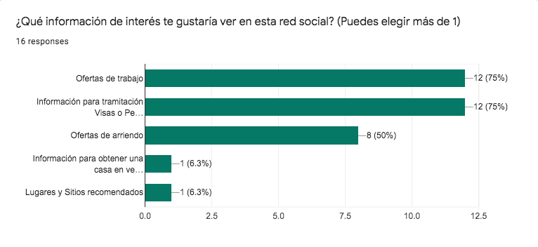
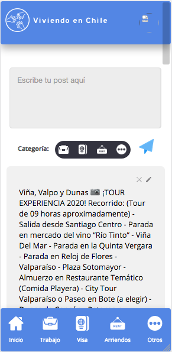
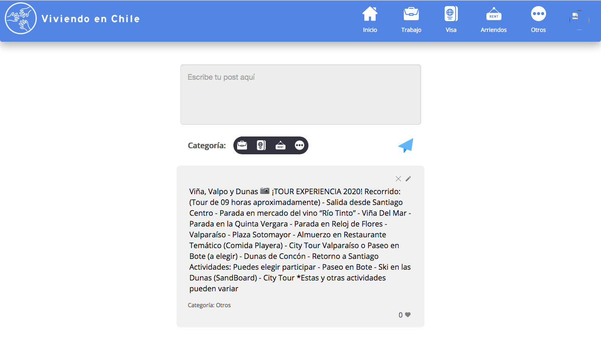

# Viviendo en Chile

## Índice
* [1. Problemática](#1-problemática)
* [2. Propuesta](#2-propuesta)
* [3. Usuario](#3-usuario)
* [4. Prototipo](#4-prototipo)
* [5. Historias de Usuario](#5-historias-de-usuario)
* [6. Organización](#6-organizacion)

***

## 1. Problemática
Migrar de tu país de origen, por las razones que sean, es una situación compleja, y llegar a un país nuevo se hace difícil cuando no tienes una red de apoyo y tampoco sabes dónde informarte sobre trabajo, vivienda, visas y otros temas de manera centralizada y rápida, en muchos casos esto puede ser engorroso incluso una perdida de tiempo y dificultar tu establecimiento en Chile.

## 2. Propuesta
"Viviendo en Chile" es una aplicación que entrega información necesaria a los inmigrantes de habla hispana que recién llegan a Chile, esta plataforma les permite conocer ofertas de empleo, los orienta con los trámites de visa, les entrega información respecto a arriendos y vivienda, todo en un sólo lugar.Pero sobre todo los conecta con otros personas migrantes, creando una gran comunidad colaborativa facilitando su integración a nuestra sociedad.

## 3. Usuario
Se realizó encuesta para entender mejor y definir realmente las necesidades del usuario.
Según esto se decidió acotar los temas de interés a: Empleo - Trámites de Visa - Arriendo de Vivienda - Otros.

## 4. Prototipo
Prototipo de alta
[Diseño UX en Figma](https://www.figma.com/proto/vtlBF9oanJkn6YRh75rKnG/RedSocial?node-id=2%3A1&scaling=scale-down)
Aplicación Responsive
Mobile version

Desktop version

## 5. Historias de Usuarios

### Historia de usuario 1
    YO COMO:  inmigrante llegando a Chile
    QUIERO: registrarme en la red social
    PARA: conocer más información para vivir en Chile.

### Historia de usuario 2
    YO COMO:  usuario registrado en la red social
    QUIERO: postear una oferta laboral
    PARA: ayudar a las personas en la comunidad de recién llegados.

### 5.1 Testeo de usabilidad
Video testeo usuario 1(https://www.loom.com/share/d142bdfba2d74a73999a6fd35434981a)

Video testeo usuario 2(https://www.loom.com/share/00bf0b33439d4f6886be54d5cac7bdf1)

En nuestros testeos se identificaron que la plataforma es fácil de usar y se entiende con rapidez la intención. 

Sin embargo iteraríamos colocando en los logos de los input de categoría al postear, el significado de cada ícono para que sean más reconocible.

También iteraríamos en colocar la foto de perfil del autor en cada post, y hacer la vista del perfil del usuario. Así las personas podrían subir sus fotos de perfil y cambiar su nombre de usuario si lo desean.

En próximas iteraciones también incluiremos subir fotos en los posts. 

## 6. Organización

Nos asiganmos las tareas por Trello(https://trello.com/b/oNcY9tao/red-social)

Y utilizamos Project e Issue de Github (https://github.com/bdiniscia/SCL012-Social-Network/projects/2)
