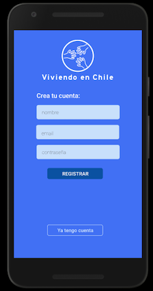
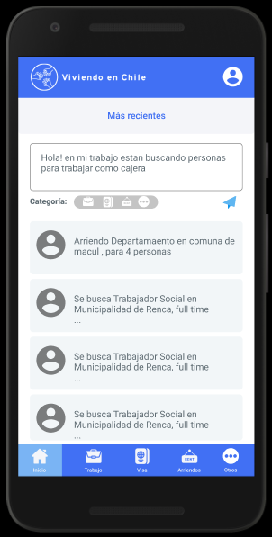

# Viviendo en Chile

## Índice

* [1. Problemática](#1-problemática)
* [2. Propuesta](#2-propuesta)
* [3. Usuario](#3-usuario)
* [4. Prototipo](#4-prototipo)
* [5. Criterios de aceptación mínimos del proyecto](#5-criterios-de-aceptación-mínimos-del-proyecto)
* [6. Hacker edition](#6-hacker-edition)

***

## 1. Problemática

Migrar de tu país de origen, por las razones que sean, es una situación compleja, y llegar a un país nuevo se hace difícil cuando no tienes una red de apoyo y tampoco sabes dónde informarte sobre trabajo, vivienda, visas y otros temas de manera centralizada y rápida, en muchos casos esto puede ser engorroso incluso una perdida de tiempo y dificultar tu establecimiento en Chile.

## 2. Propuesta

"Viviendo en Chile" es una aplicación que entrega información necesaria a los inmigrantes de habla hispana que recién llegan a Chile, esta plataforma les permite conocer ofertas de empleo, los orienta con los trámites de visa, les entrega información respecto a arriendos y vivienda, todo en un sólo lugar.Pero sobre todo los conecta con otros personas migrantes, creando una gran comunidad colaborativa facilitando su integración a nuestra sociedad.

## 3. Usuario

Se realizó encuesta para entender mejor y definir realmente las necesidades del usuario. 
Según esto se decidió acotar los temas de interés a: Empleo - Trámites de Visa - Arriendo de Vivienda - Otros.

 

## 4. Prototipo

Prototipo de alta 
[Diseño UX en Figma](https://www.figma.com/proto/vtlBF9oanJkn6YRh75rKnG/RedSocial?node-id=2%3A1&scaling=scale-down)

 
 

### 4.1 Historia de Usuario

H.U. 1: Yo COMO inmigrante llegando a Chile QUIERO registrarme en la red social PARA conocer más información para vivir en Chile.

H.U: 2:Yo COMO usuario registrado en la red social QUIERO postear una oferta laboral PARA ayudar a las personas en la comunidad de recién llegados.

### 4.2 Testeo de usuarios

## 3. Objetivos de aprendizaje

El objetivo principal de aprendizaje de este proyecto es construir una
[Single-page Application (SPA)](https://es.wikipedia.org/wiki/Single-page_application)
[_responsive_](https://github.com/Laboratoria/curricula-js/tree/master/topics/css/02-responsive)
 (con más de una vista / página) en la que podamos **leer y escribir datos.**

### HTML y CSS

* [ ] [HTML semántico](https://developer.mozilla.org/en-US/docs/Glossary/Semantics#Semantics_in_HTML)
* [ ] [CSS `flexbox`](https://css-tricks.com/snippets/css/a-guide-to-flexbox/)
* [ ] Construir tu aplicación respetando el diseño realizado (maquetación).

* [Modulos: Export](https://developer.mozilla.org/es/docs/Web/JavaScript/Referencia/Sentencias/export)
* [Modulos: Import](https://developer.mozilla.org/es/docs/Web/JavaScript/Referencia/Sentencias/import)
* [Diseño web, responsive design y la importancia del mobile first - Media Click](https://www.mediaclick.es/blog/diseno-web-responsive-design-y-la-importancia-del-mobile-first/)
* [Mobile First: el enfoque actual del diseño web móvil - 1and1](https://www.1and1.es/digitalguide/paginas-web/diseno-web/mobile-first-la-nueva-tendencia-del-diseno-web/)
* [Mobile First - desarrolloweb.com](https://desarrolloweb.com/articulos/mobile-first-responsive.html)
* [Mobile First - ZURB](https://zurb.com/word/mobile-first)
* [Mobile First Is NOT Mobile Only - Nielsen Norman Group](https://www.nngroup.com/articles/mobile-first-not-mobile-only/)
